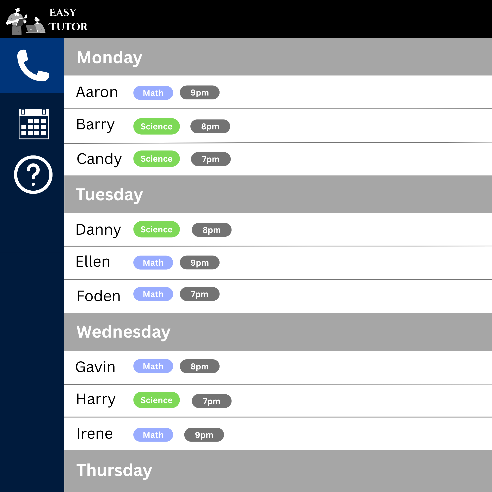

# Easy Tutor

Easy Tutor is a desktop application that helps private tutors manage their students and lesson schedules in one place. It is optimized for users who prefer a fast, keyboard-driven workflow while still providing a clear visual overview of upcoming lessons.

## Features

* Manage student records and lesson details.
* Organize lessons by day, subject, and time.
* Find student information quickly using text commands.
* View upcoming lessons at a glance.

For detailed instructions on using Easy Tutor, see the [User Guide](docs/UserGuide.md).

For information about the design and implementation of Easy Tutor, see the [Developer Guide](docs/DeveloperGuide.md).

## Acknowledgements

This project is based on the AddressBook-Level3 project created by the [SE-EDU initiative](https://se-education.org).
